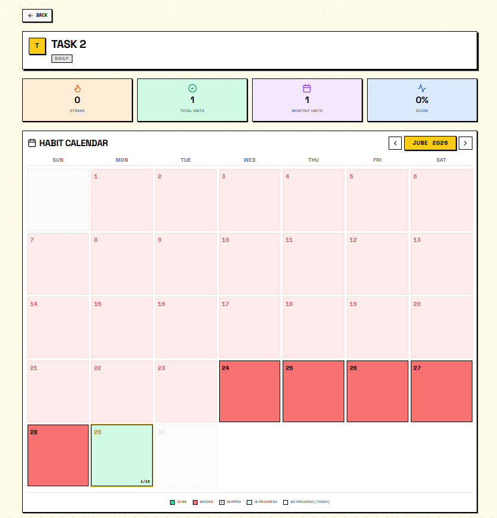

# ⚡ TaskMaste - Smart Task Manager

A high-performance, full-stack task management application featuring a striking **Neo-Brutalist** design language. Built with React (Vite), Express, and MongoDB, and animated with GSAP.

---

## 📸 App Preview & Screenshots

### 🏠 Landing Home Page


### 📊 Main Task Dashboard (Unified Yellow Theme)


### 📅 Responsive Calendar View


### 🔍 Detailed Task Info & Habit Calendar


---

## 🎨 Neo-Brutalist Design & Aesthetics

TaskMaste stands out with a deliberate, high-contrast **Neo-Brutalist** visual style:
* **High Contrast Borders:** Solid 2px-3px black borders (`border-2 border-black`) with flat shadow elevations.
* **Vibrant Retro Palettes:** Playful yet functional colors contrasting with clean whites, deep blacks, and a fully customizable Dark Mode system.
* **Solid Geometry:** Sharp corners, retro typography pairings (Space Grotesk & Space Mono), and raw mechanical layouts.
* **GSAP-Powered Navigation:** Features a premium global **Staggered Menu** navigation bar with staggered item entrance animations and responsive layout compliance.

---

## 📱 Mobile-First Responsive Enhancements

The application layout has been refined to eliminate collisions and provide a seamless mobile experience:
* **Decoupled Task Cards:** Badges (streaks, repetition counts, recurrence icons) are split into a dedicated meta-row below the task title, preventing text truncation or overlap with action buttons (like the task increment `+` or menu `...` button).
* **Responsive Quick Add:** The quick task-creation form dynamically switches from horizontal to vertical stacking (`flex-col sm:flex-row`) on mobile, making the text field fully readable and letting buttons expand to full width.
* **Responsive Search & Filter Bar:** Stacks options vertically on mobile while retaining compact inline controls on desktop. Filter dropdown options switch from 3-columns to 1-column layouts to ensure readability.
* **Keyboard Accessibility:** Fully integrated with screen readers and keyboard users. Closing the staggered navigation menu automatically shifts focus back to the menu toggle button and marks child links as unfocusable (`tabIndex={-1}`), avoiding `aria-hidden` container focus errors.

---

## ✨ Features

- **Authentication**: JWT-based (access + refresh tokens) stored securely in HTTP-only cookies.
- **One-time Tasks**: Complete CRUD operations with priority levels, categories, tag arrays, and due dates.
- **Repeating Tasks**: Daily recurring tasks with virtual occurrence generators and streak/Flame trackers.
- **Streaks & Progress**: Track daily streak flame counters and weekly progress completion levels.
- **Interactive Calendar View**: Toggle between weekly and monthly calendar grids with clickable day navigations.
- **Drag & Drop Reordering**: Reorder and prioritize daily task sequences with smooth animations via `@dnd-kit`.
- **System Notifications**: Integrated browser reminder notifications triggering before task due times.
- **Multi-Format Export**: Export tasks to standard `.csv` or `.json` formats instantly.

---

## 🛠️ Tech Stack

| Layer | Technology | Description |
|-------|-----------|-------------|
| **Frontend** | React 18, Vite | High-performance client-side rendering |
| **Styling** | Tailwind CSS | Utility-first CSS configured with custom neo-brutalist variables |
| **Animations**| GSAP | High-performance custom layout animations & staggered effects |
| **Backend** | Node.js, Express.js | Modular REST API routing and middleware pipelines |
| **Database** | MongoDB & Mongoose | Document storage with object data modeling schemas |
| **Drag & Drop**| `@dnd-kit` | Lightweight and modular drag-and-drop toolkit |

---

## 🚀 Getting Started

### 📋 Prerequisites
- **Node.js** v18+
- **MongoDB** local instance or MongoDB Atlas cluster connection URI

### 🔧 Installation

Install dependencies for both frontend and backend modules:
```bash
# Install all workspace dependencies
npm run install:all
```

### 🔑 Environment Configuration

Create a `.env` file in the root directory:
```env
PORT=5000
MONGODB_URI=mongodb+srv://<username>:<password>@cluster.mongodb.net/taskmaste
JWT_SECRET=your_jwt_secret_key_here
JWT_REFRESH_SECRET=your_refresh_secret_key_here
CLIENT_URL=http://localhost:5173
```

### 💻 Running the Application

Start the backend API server and frontend client concurrently:
```bash
# Run both frontend & backend concurrently in development mode
npm run dev:client  # Runs React client at http://localhost:5173
npm run dev:server  # Runs Express server at http://localhost:5000
```

---

## 🔌 API Endpoints

### 🔐 Auth Router (`/api/auth`)
| Method | Endpoint | Description |
|--------|----------|-------------|
| **POST** | `/register` | Register a new user account |
| **POST** | `/login` | Authenticate user and assign token cookies |
| **POST** | `/logout` | Invalidate active session and clear token cookies |
| **POST** | `/refresh` | Obtain a new access token via refresh token |
| **GET** | `/me` | Retrieve the authenticated user's profile |
| **PUT** | `/profile` | Update account preferences and settings |
| **DELETE**| `/account` | Delete user profile and all associated tasks |

### 📝 Tasks Router (`/api/tasks`)
| Method | Endpoint | Description |
|--------|----------|-------------|
| **GET** | `/` | Fetch tasks (supporting date and layout view filters) |
| **POST** | `/` | Create a new one-time or repeating task |
| **PUT** | `/:id` | Update task details |
| **DELETE**| `/:id` | Remove task |
| **PATCH** | `/:id/complete` | Toggle completion status for one-time tasks |
| **PATCH** | `/:id/complete/:date`| Complete a repeating task occurrence on a specific date |
| **PATCH** | `/:id/skip/:date` | Skip a repeating task occurrence on a specific date |
| **PATCH** | `/bulk` | Bulk delete or mark tasks as completed |
| **PATCH** | `/reorder` | Update task array sequence order (DND) |
| **GET** | `/summary` | Get task progress statistics for dashboard |
| **GET** | `/all` | Fetch all tasks for CSV/JSON backup exports |

### 🏷️ Categories Router (`/api/categories`)
| Method | Endpoint | Description |
|--------|----------|-------------|
| **GET** | `/` | Fetch all custom task categories |
| **POST** | `/` | Create a new custom task category |
| **PUT** | `/:id` | Update category label or theme color |
| **DELETE**| `/:id` | Delete category |

---

## 🚀 Hosting on Vercel

TaskMaste is pre-configured to be deployed as a single monorepo project on **Vercel** utilizing the root `vercel.json` and package configurations.

### 📋 Prerequisites
* A MongoDB Atlas database cluster.
* A Vercel account linked to your GitHub account.

### 🛠️ Step-by-Step Deployment
1. **Push Code to GitHub:**
   Ensure your local branch is fully pushed to GitHub (already completed at `https://github.com/PrafullHarer/TaskMaste.git`).
2. **Import Project on Vercel:**
   * Go to your [Vercel Dashboard](https://vercel.com/dashboard) and click **"Add New"** -> **"Project"**.
   * Import the **`TaskMaste`** repository.
3. **Configure Project Settings:**
   * **Framework Preset:** Select **"Other"** (Vercel will automatically read root scripts and `vercel.json`).
   * **Root Directory:** Keep it as root `./`.
   * **Build and Development Settings:**
     * **Build Command:** `npm run build`
     * **Output Directory:** `dist`
     * **Install Command:** `npm run install:all` (crucial to install dependencies in both the `server` and `client` subdirectories).
4. **Environment Variables:**
   Add the following variables under the **"Environment Variables"** tab:
   * `MONGODB_URI`: Your MongoDB Atlas connection string (e.g. `mongodb+srv://...`).
   * `JWT_SECRET`: A secure random string for JWT authentication.
5. **Deploy:**
   Click **"Deploy"**. Vercel will install, build the frontend, and run your Express API endpoints through Vercel Functions.

---

## 📂 Project Structure

```text
├── client/               # React Frontend (Vite + Tailwind)
│   ├── src/
│   │   ├── api/          # Axios configurations and endpoint requests
│   │   ├── components/   # Reusable UI widgets (StaggeredMenu, TaskCard, QuickAdd)
│   │   ├── context/      # Context providers (AuthContext, TaskContext)
│   │   ├── hooks/        # Shared utility hooks
│   │   ├── pages/        # Main application views (Dashboard, Calendar, Upcoming)
│   │   └── utils/        # Formatting utilities & CSV/JSON exporters
│   └── ...config files
│
├── server/               # Express Backend (Node.js)
│   ├── api/              # Vercel serverless gateway
│   ├── config/           # Database configuration
│   ├── controllers/      # Route handler operations
│   ├── middleware/       # JWT auth filters & error catchers
│   ├── models/           # Mongoose task, category, and user schemas
│   ├── routes/           # REST router definitions
│   ├── scripts/          # Database seeding and utility scripts
│   └── utils/            # JWT generators & recurrence calculation algorithms
│
└── vercel.json           # Vercel deployment and rewrite routes config
```

---

## 👥 Creator

Made with ⚡ by **Prafull Harer** (GitHub: [@PrafullHarer](https://github.com/PrafullHarer))
